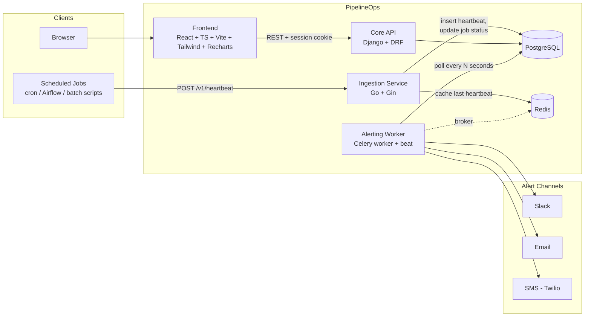

# PipelineOps

[](https://github.com/sahilkalgutkar/PipelineOps/actions/workflows/ci.yml)

I built a job-monitoring and alerting platform for teams running scheduled
data pipelines — cron jobs, Airflow DAGs, batch ETL scripts. Jobs send a
heartbeat on every run; PipelineOps tracks expected intervals, flags jobs
that go quiet or fail, and pages the team before a stakeholder notices a
silent failure.

Silent pipeline failures are one of the most common blind spots in data
platform teams: a DAG stops firing, a cron job's host gets decommissioned, a
script starts throwing on line one — and nobody finds out until a downstream
report is wrong. I built PipelineOps to close that gap.

## Architecture



I built the ingestion service and the core API as two independent processes
that share one Postgres schema: Django's migrations own the schema, the Go
service writes to it directly with raw SQL for throughput, and the alerting
worker reads it on a beat schedule. I didn't introduce a message queue
between them because nothing here needs one — the shared table already is
the integration point.

## Why a polyglot stack

I picked each service because it's the right tool for that job, not to pad
the architecture — but each also happens to demonstrate a different part of
a platform-engineering skill set:

| Component | Stack | What it demonstrates |
|---|---|---|
| Frontend dashboard | React + TypeScript, Vite, Tailwind, Recharts | Building a real data UI: auth flow, live status, charts |
| Core API (jobs, users, alert rules) | Django + Django REST Framework, PostgreSQL | A production-shaped REST API: auth, serializers, admin, migrations |
| Heartbeat ingestion | Go + Gin, pgx, go-redis, Prometheus | A high-throughput, low-latency write path, independent of the Django app |
| Alerting worker | Celery (worker + beat), reading the same Postgres schema | Scheduled background processing tied to the same data model |
| Local infra | Docker Compose | Multi-service orchestration, healthchecks, dependency ordering |
| Deployment | Kubernetes manifests (Deployments, HPA, Ingress) + an AWS (RDS/ElastiCache/EKS) deployment guide | Container orchestration and cloud deployment |

## Auth: what changed and why

I originally built the API with DRF token auth, with the token kept in the
frontend's `localStorage` — it worked, but it was a real weak spot: any
XSS on the page (an injected script, a compromised dependency) could read
that token straight out of storage and walk off with a fully-authenticated
session, no further access needed.

I switched it to httpOnly session cookies instead. `/api/auth/login/` sets a
`sessionid` cookie the browser stores but JS genuinely cannot read — I
verified this directly, not just assumed it: `document.cookie` in a real
browser session only ever shows `csrftoken`, never `sessionid`. State-changing
requests also require a CSRF token echoed back in a header, so a
malicious site can't ride an existing session to forge requests either.
See [core-api's README](core-api/README.md#auth) for the mechanics.

## Repository layout

```
PipelineOps/
├── frontend/            React + TS dashboard (Vite, Tailwind, Recharts)
├── core-api/             Django + DRF API, Celery worker/beat, alert notifiers
├── ingestion-service/    Go + Gin heartbeat ingestion service
├── infra/k8s/            Kubernetes manifests (kind-ready, EKS-ready)
├── .github/workflows/    CI — lint, test, build for all three services
└── docker-compose.yml    Full local stack
```

## Testing & CI

Every push to `main` and every PR runs [`.github/workflows/ci.yml`](.github/workflows/ci.yml):
Go vet/lint/test for `ingestion-service`, `ruff` + the Django test suite
(against a real Postgres) for `core-api`, and lint/test/build for
`frontend`. Same commands locally:

```bash
cd ingestion-service && go vet ./... && go build ./... && go test ./...
cd core-api && pip install -r requirements-dev.txt && ruff check . && python manage.py test
cd frontend && npm ci && npm run lint && npm test && npm run build
```

## Quick start (Docker Compose)

Requires Docker. No local Node/Python/Go install needed — everything runs
in containers.

```bash
git clone <this-repo>
cd PipelineOps
docker compose up --build
```

This starts Postgres, Redis, the Django API, the Celery worker + beat, the
Go ingestion service, and the frontend, running migrations and seeding an
`admin` / `admin` superuser automatically (dev-only — see `.env.example`
to disable that).

| Service | URL |
|---|---|
| Frontend dashboard | http://localhost:5173 |
| Core API | http://localhost:8000/api/ |
| Django admin | http://localhost:8000/admin/ |
| Ingestion service | http://localhost:8080 |

> If a port above is already taken on your machine, override it, e.g.
> `POSTGRES_HOST_PORT=5434 FRONTEND_HOST_PORT=5175 docker compose up --build`.

### Try it end to end

Auth is a session cookie, not a bearer token (see [core-api's
README](core-api/README.md#auth)), so scripting the API means carrying a
cookie jar and echoing the CSRF cookie back as a header, same as the
frontend does:

```bash
# 1. Prime the CSRF cookie, then log in (the session cookie lands in the jar)
curl -s -c cookies.txt -b cookies.txt localhost:8000/api/auth/me/ > /dev/null
CSRF=$(grep csrftoken cookies.txt | awk '{print $NF}')
curl -s -c cookies.txt -b cookies.txt -X POST localhost:8000/api/auth/login/ \
  -H "Content-Type: application/json" -H "X-CSRFToken: $CSRF" \
  -d '{"username":"admin","password":"admin"}'

# 2. Django rotates the CSRF token on login, so re-read it from the jar
# before the next state-changing request — reusing the pre-login value 403s.
CSRF=$(grep csrftoken cookies.txt | awk '{print $NF}')
curl -s -c cookies.txt -b cookies.txt -X POST localhost:8000/api/jobs/ \
  -H "Content-Type: application/json" -H "X-CSRFToken: $CSRF" \
  -d '{"name":"nightly-etl","expected_interval_seconds":86400,"grace_period_seconds":300}'

# 3. Send a heartbeat, as the job itself would on every run
curl -s -X POST localhost:8080/v1/heartbeat \
  -H "Content-Type: application/json" \
  -d '{"job":"nightly-etl","status":"success","duration_ms":4231}'

# 4. Watch it show up healthy on the dashboard at http://localhost:5173
```

Stop sending heartbeats past the job's expected interval + grace period and
`celery-beat`'s `check_missed_heartbeats` task (runs every 30s by default)
opens an `AlertEvent` and fires the configured channel — Slack by default,
falling back to a log line if `SLACK_WEBHOOK_URL` isn't set.

## Local Kubernetes (kind)

See [infra/k8s/README.md](infra/k8s/README.md) for the full walkthrough —
`kind create cluster`, install `ingress-nginx`, load the three app images,
`kubectl apply -k infra/k8s/`.

## AWS deployment

I wrote the Kubernetes manifests to run unmodified on EKS once you swap the
in-cluster Postgres/Redis for managed equivalents. I haven't run this against
a real AWS account (none is wired up here) — this is the deployment path I
designed the manifests for.

1. **ECR** — create three repositories and push the three app images:
   ```bash
   aws ecr create-repository --repository-name pipelineops/core-api
   aws ecr create-repository --repository-name pipelineops/ingestion
   aws ecr create-repository --repository-name pipelineops/frontend

   aws ecr get-login-password | docker login --username AWS --password-stdin <account>.dkr.ecr.<region>.amazonaws.com
   docker build -t <account>.dkr.ecr.<region>.amazonaws.com/pipelineops/core-api:latest ./core-api
   docker push <account>.dkr.ecr.<region>.amazonaws.com/pipelineops/core-api:latest
   # repeat for ingestion-service and frontend
   ```

2. **RDS (PostgreSQL)** — provision a `db.t4g.micro` (or larger) Postgres
   instance in the same VPC as your EKS cluster. Put its connection string
   in the `DATABASE_URL` key of the `pipelineops-secrets` Secret instead of
   the in-cluster `postgres` host.

3. **ElastiCache (Redis)** — provision a `cache.t4g.micro` Redis node in the
   same VPC. Put its endpoint in the ConfigMap's `REDIS_URL`.

4. **EKS** — create the cluster and point kubectl at it:
   ```bash
   eksctl create cluster --name pipelineops --region <region> --nodes 2 --node-type t3.medium
   aws eks update-kubeconfig --name pipelineops --region <region>
   ```

5. **AWS Load Balancer Controller** in place of `ingress-nginx`, so the
   `Ingress` in `infra/k8s/60-ingress.yaml` provisions an ALB. Install it
   per [the AWS docs](https://docs.aws.amazon.com/eks/latest/userguide/aws-load-balancer-controller.html),
   change `ingressClassName` to `alb`, and add the standard
   `alb.ingress.kubernetes.io/*` annotations for scheme and target type.

6. **Apply the manifests** from `infra/k8s/`, skipping `20-postgres.yaml`
   and `21-redis.yaml` (RDS/ElastiCache replace them), with images pointing
   at ECR instead of `imagePullPolicy: IfNotPresent` local tags.

7. **Route 53 + ACM** for a real domain and TLS in front of the ALB, and
   **Secrets Manager** (via External Secrets Operator) instead of a plain
   Kubernetes `Secret` for anything beyond a demo. Once that TLS is
   terminating real traffic, flip `DJANGO_SESSION_COOKIE_SECURE` and
   `DJANGO_CSRF_COOKIE_SECURE` to `"true"` in the ConfigMap — they're
   `"false"` for the local `kind` walkthrough because that's plain HTTP.

## What's deliberately out of scope

- gRPC on the ingestion endpoint (the spec allows either; HTTP/JSON keeps
  the demo dependency-free — a `.proto` for the same contract would be a
  natural next step).
- SMS alerting is wired up (`alerts/notifiers.py`) but no-ops without a
  Twilio account — same pattern as Slack/email.
- Multi-tenancy / organizations — jobs currently belong to individual users.

## License

[MIT](LICENSE)
